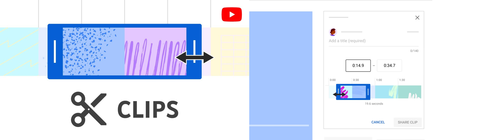

<div align="center">
  


</div>

# YT-Clip-Downloader

YT-Clip-Downloader is a Python script designed to download segments of a YouTube video based on a YouTube clip URL. Given a YouTube clip URL, this script queries the YouTube APIs to obtain the start and end time codes of the sub-clip in relation to the full video and downloads only that specific segment.

## Features

- Extracts start and end times of YouTube clips in relation to the full video.
- Fetches video details using YouTube API.
- Downloads the specified segment of the video using `yt-dlp` and `ffmpeg`.

## Example

Given a YouTube clip URL:

```
https://youtube.com/clip/UgkxYimXng8oFu_jEOyBKr5Lx2lv8ELOKcHy?si=bVLQt1Bdnk8AkusH
```

The script will return the start and end times of the sub-clip in relation to the full video and download that segment.

## Usage

1. Clone the repository:
```
git clone https://github.com/yourusername/YT-Clip-Downloader.git
```

2. Install the dependencies:

```sh
poetry install
```

3. YouTube Data API v3

Next, you need to create a `.env` file in the root directory of the project. This file will store your YouTube Data API v3 key. Use the following command to create and add your API key to the `.env` file:

```bash
echo "API_KEY=<your-key>" > .env
```

Ensure your `.env` file contains your `API_KEY` key in this format:

```plaintext
API_KEY=<your-key>
```

4. Run the script:
```sh
poetry run youtube-clip-info
```

5. Follow the prompts to enter the YouTube clip URL and download the specified segment.

## Configuration

The script uses a configuration file `config.json` to set the desired video buffer:
```json:YT-Clip-Downloader/config.json
{
    "desired_video_buffer": 30
}
```

## License

This project is licensed under the MIT License.

## Contributing

Contributions are welcome! Please open an issue or submit a pull request.

## Acknowledgements

- [yt-dlp](https://github.com/yt-dlp/yt-dlp)
- [ffmpeg](https://ffmpeg.org/)
- [Google API Python Client](https://github.com/googleapis/google-api-python-client)

## TODOs
- Change the output encoding to H.264.
- Output the timecode using YT-DLP friendly bash syntax. `yt-dlp --download-sections "*HH:MM:SS-HH:MM:SS" [VIDEO_URL]`